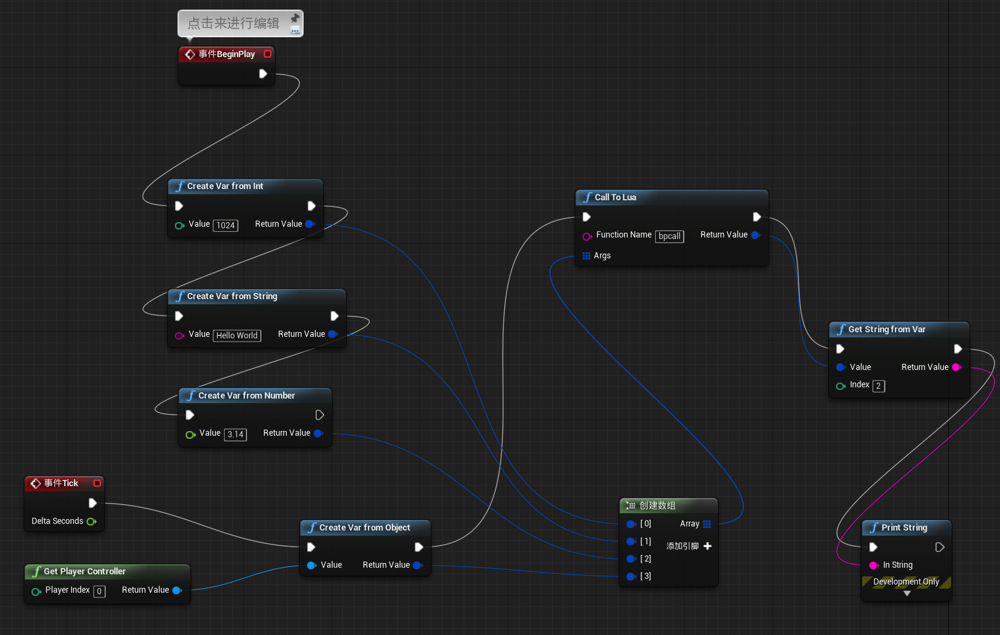

# slua-unreal 是什么

slua-unreal作为unreal引擎的插件，通过unreal自带蓝图接口的反射能力，结合libclang静态c++代码分析，自动化导出蓝图接口和静态c++接口，提供给lua语言，使得可以通过lua语言开发unreal游戏业务逻辑，方便游戏高效迭代开发，上线热更新，同时支持lua到c++双向，lua到蓝图双向调用，使用lua语言完美替代unreal的c++开发方式，修改业务逻辑不需要等待c++编译，大大提升开发速度。

目前该项目作为潘多拉系统的一部分，用于剑侠，刺激战场，全军出击业务，构建这些业务的周边系统、运营系统，上线质量稳定。

# slua-unreal 有什么功能

* 通过蓝图反射机制，自动导出unreal 4的蓝图api到lua接口
* 支持以lua function作为蓝图事件的回调函数
* 支持普通c++函数和类 通过静态代码生成或者泛型代码展开导出到lua接口，同时支持与蓝图接口交互
* 完整支持了unreal4的枚举，并导出了全部枚举值到lua
* 支持FVector等非蓝图类，同时支持操作符重载
* 支持扩展方法，将某些未标记为蓝图方法的函数，手动添加到蓝图类中，例如UUserWidget的GetWidgetFromName方法。
* 支持从蓝图中调入lua，并接收lua返回值，支持任意参数类型和任意参数个数。
* 支持蓝图out标记参数，支持c++非const引用作为out类型参数返回。

# 使用方法简单范例

```lua
-- import blueprint class to use
local Button = import('Button');
local ButtonStyle = import('ButtonStyle');
local TextBlock = import('TextBlock');
local SluaTestCase=import('SluaTestCase');
-- call static function of uclass
SluaTestCase.StaticFunc()
-- create Button
local btn=Button();
local txt=TextBlock();
-- load panel of blueprint
local ui=slua.loadUI('/Game/Panel.Panel');
-- add to show
ui:AddToViewport(0);
-- find sub widget from the panel
local btn2=ui:FindWidget('Button1');
local index = 1
-- handle click event
btn2.OnClicked:Add(function() 
    index=index+1
    print('say helloworld',index) 
end);
-- handle text changed event
local edit=ui:FindWidget('TextBox_0');
local evt=edit.OnTextChanged:Add(function(txt) print('text changed',txt) end);

-- use FVector
local p = actor:K2_GetActorLocation()
local h = HitResult()
local v = FVector(math.sin(tt)*100,2,3)
local offset = FVector(0,math.cos(tt)*50,0)
-- support Operator
local ok,h=actor:K2_SetActorLocation(v+offset,true,h,true)
-- get referenced value
print("hit info",h)
```

## 在蓝图中调用lua



```
-- this function called by blueprint
function bpcall(a,b,c,d)
    print("call from bp",a,b,c,d)
end
```

Output is:

Slua:     call from bp    1024    Hello World 3.1400001049042 UObject: 0x136486168

# 相关参考

slua-unreal依赖dot-clang做c++静态代码生成，请参考：

http://git.code.oa.com/leeyi/dot-clang.git